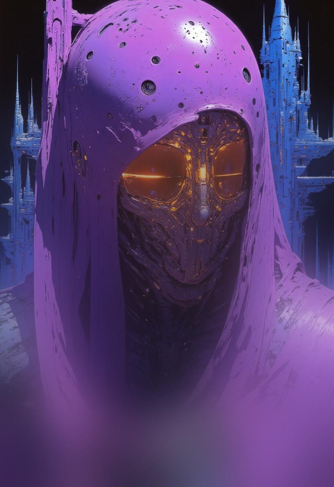

# Progressive Blur

<div align="center">
  
  
</div>

A Python library that applies a smooth, progressive blur effect to images. The blur intensity increases gradually from top to bottom, creating an aesthetic transition effect.

## Installation

Install via pip:
```bash
pip install progressive-blur
```

Or install from source:
```bash
git clone https://github.com/almmaasoglu/python-progressive-blur.git
cd python-progressive-blur
pip install -e .
```

## Quick Start

```python
from PIL import Image
from progressive_blur import apply_progressive_blur

# Load your image
image = Image.open("your_image.jpg")

# Apply blur with default parameters
blurred = apply_progressive_blur(image)
blurred.save("blurred_image.jpg")

# Or customize the blur effect
custom_blurred = apply_progressive_blur(
    image,
    max_blur=30.0,        # Less intense blur
    clear_until=0.3,      # Keep top 30% clear
    blur_start=0.4,       # Start blur at 40% from top
    end_y=0.9            # Reach max blur at 90% from top
)
custom_blurred.save("custom_blurred.jpg")
```

## Parameters

- `image` (PIL.Image or bytes): Input image
- `max_blur` (float): Maximum blur radius (default: 50.0)
- `clear_until` (float): Percentage of image to keep completely clear (default: 0.15)
- `blur_start` (float): Percentage where blur starts to appear (default: 0.25)
- `end_y` (float): Percentage where maximum blur is reached (default: 0.85)

## Project Structure

```
progressive-blur/
├── LICENSE              # MIT License
├── README.md           # This file
├── setup.py            # Package configuration
├── examples/           # Example scripts
│   └── test_blur.py    # Example usage and testing
└── progressive_blur/   # Main package
    ├── __init__.py
    └── blur.py        # Core implementation
```

## Examples

Check out the `examples` directory for more usage examples. The `test_blur.py` script demonstrates:
- Processing multiple images
- Working with different image formats (JPG, PNG, WebP)
- Handling transparency in WebP images
- Custom blur parameters

## Requirements

- Python 3.6+
- Pillow >= 8.0.0
- NumPy >= 1.19.0

## License

This project is licensed under the MIT License - see the [LICENSE](LICENSE) file for details.