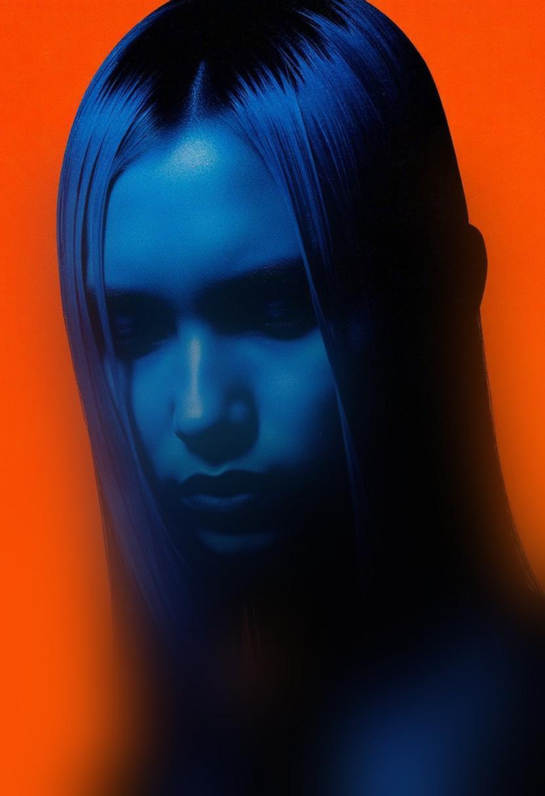

# Progressive Blur

<div align="center">
  
  
</div>

A Python library that applies a progressive blur effect to images, creating a smooth transition from clear to blurred areas. For creating visually appealing image effects where you want to gradually blur portions of an image.

## Features

- Progressive blur effect with customizable parameters
- Support for multiple image formats (JPG, JPEG, PNG, WebP)
- Handles transparent WebP images (RGBA mode)
- Easy-to-use interface
- Configurable blur intensity and transition zones

## Installation

```bash
pip install pillow numpy
```

## Usage

```python
from PIL import Image
from progressive_blur import apply_progressive_blur

# Load your image
image = Image.open("your_image.jpg")

# Apply progressive blur
blurred_image = apply_progressive_blur(image)

# Save the result
blurred_image.save("blurred_output.jpg")
```

## Blur Parameters

The blur effect can be customized with the following parameters:

- `max_blur`: Maximum blur radius (default: 50.0)
- `clear_until`: Percentage of image height to keep completely clear (default: 15%)
- `blur_start`: Percentage where blur starts to appear (default: 25%)
- `end_y`: Percentage where maximum blur is reached (default: 85%)

## Example

Place your images in the `test_images` directory and run:

```python
python test_blur.py
```

Processed images will be saved in the `output_images` directory.

## Requirements

- Python 3.6+
- Pillow (PIL)
- NumPy

## License

This project is licensed under the MIT License - see the LICENSE file for details.